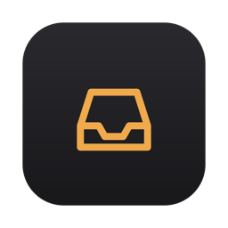
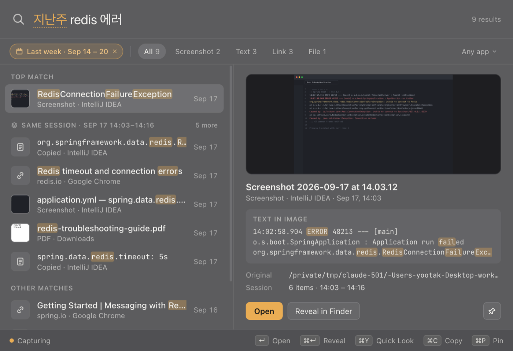

<p align="center">
  
</p>

<h1 align="center">Digital Desk</h1>

<p align="center">
  <b>Capture first. Organize never. Find later.</b><br>
  복사하고, 캡처하고, 다운로드한 것을 알아서 모아 두고 — 나중에 검색 한 번으로 다시 찾는 macOS 앱
</p>

<p align="center">
  <a href="https://github.com/yoon-yoo-tak/digital-desk/releases/latest"><b>⬇ 최신 버전 다운로드 (.dmg)</b></a>
</p>



## 무엇을 하나요

"분명 며칠 전에 봤는데 어디 있었지?" — 스크린샷은 데스크탑에, 에러 메시지는 클립보드에, 문서는 브라우저 탭에, PDF는 다운로드 폴더에 흩어져 있습니다. Digital Desk는 이것들을 **평소처럼 쓰기만 하면** 한곳에 모아 둡니다.

- **자동 기록** — 클립보드(텍스트·링크·이미지·파일), 스크린샷, 다운로드. 저장 버튼도, 폴더도, 태그도 없습니다.
- **스크린샷 속 글자까지 검색** — 기기 안에서 OCR(한국어·영어)을 돌려, 에러 화면을 찍어 두면 에러 이름으로 찾을 수 있습니다.
- **말하듯 검색** — `⌘⇧Space` → `지난주 redis 에러`. "지난주"는 날짜로, "에러"는 `Exception`·`error`까지 찾습니다. AI 없이 전부 로컬에서.
- **같은 작업은 함께** — 에러를 캡처하고, 메시지를 복사하고, 문서를 연 그 오후가 "Same session"으로 묶여 나옵니다.
- **조용하게** — 알림을 띄우지 않습니다. 메뉴바에서 언제든 일시정지할 수 있습니다.

## 설치

요구 사항: macOS 13 이상. Apple Silicon·Intel 공용(universal) 빌드이며, Apple Silicon + macOS 27에서 테스트했습니다(Intel Mac은 아직 확인하지 못했습니다).

1. [Releases](https://github.com/yoon-yoo-tak/digital-desk/releases/latest)에서 `Digital-Desk-x.y.z-universal.dmg`를 받습니다.
2. dmg를 열고 **Digital Desk**를 **Applications** 폴더로 끌어다 놓습니다.
3. Applications에서 Digital Desk를 엽니다. 처음에는 _"Apple에서 확인할 수 없습니다"_ 경고가 나옵니다 — **완료**를 누르세요.
4. **시스템 설정 › 개인정보 보호 및 보안**으로 가서 아래쪽의 _"Digital Desk이(가) 차단되었습니다"_ 옆 **그래도 열기**를 누르고, 암호를 입력한 뒤 한 번 더 **열기**를 누릅니다.
5. 온보딩 3단계에서 macOS가 **데스크탑·다운로드 폴더 접근**을 물으면 **허용**합니다(새 스크린샷과 다운로드를 기록하기 위해서입니다).

> **왜 경고가 뜨나요?** 이 앱은 Apple 개발자 인증서로 서명·공증되지 않았습니다(오픈소스 개인 프로젝트). 코드는 이 저장소에 전부 공개되어 있고, 서버로 아무것도 보내지 않습니다.
> 터미널이 익숙하다면 3–4단계 대신 `xattr -dr com.apple.quarantine "/Applications/Digital Desk.app"` 후 열어도 됩니다.

## 사용법

| 단축키 | 동작 |
|---|---|
| `⌘⇧Space` | 어디서든 Quick Search 열기(설정 › Shortcuts에서 변경) |
| `↵` | 열기 (텍스트는 복사) |
| `⌘↵` | Finder에서 보기 / 링크 URL 복사 |
| `⌘Y` | Quick Look |
| `⌘C` · `⌘P` | 복사 · Desk에 고정 |
| `⌘1`–`⌘5` | 스크린샷·텍스트·링크·파일·이미지만 보기 |
| `⌥⌘P` | 기록 일시정지 / 재개 |

검색 문법: `오늘`·`어제`·`이번주`·`지난주`·`이번달`·`지난달`(영어 `today`·`last week`…), `type:screenshot`, `app:Chrome`, `domain:github.com`.

메인 창(메뉴바 › Open Digital Desk)에는 시간순 **Inbox**, 고정한 **Desk**, 보관한 **Archive**가 있습니다. `⌘⌫`로 지우고 `⌘Z`로 되돌립니다.

## 개인정보

- 모든 데이터는 이 Mac의 `~/Library/Application Support/Digital Desk`에만 있습니다. 계정·서버·텔레메트리가 없습니다.
- 화면을 녹화하지 않습니다. **직접 복사·캡처·다운로드한 것만** 기록합니다. 데스크탑에서도 스크린샷과 브라우저로 받은 파일만 봅니다.
- 1Password·키체인·암호 앱과 비밀번호 관리자가 "숨김"으로 표시한 복사는 기록하지 않습니다. 설정에서 제외 앱을 추가할 수 있습니다.
- 유일한 네트워크 요청은 복사한 공개 링크의 페이지 제목 가져오기이며, 설정 › Privacy에서 끌 수 있습니다(사설·로컬 주소는 가져오지 않습니다).
- 원본 파일은 절대 옮기거나 지우지 않습니다. Digital Desk에서 지우면 기록만 사라집니다.

## 직접 빌드

필요한 것: macOS, Node.js 22+, Xcode Command Line Tools(`xcode-select --install`, 네이티브 헬퍼를 Swift로 빌드합니다).

```bash
npm install
npm run dev          # 개발 실행 (데이터: ~/Library/Application Support/Digital Desk (Dev))
npm run seed         # 데모 데이터 채우기 ("지난주 redis 에러"를 바로 시험해 볼 수 있습니다)
npm test             # 단위·통합 테스트 (vitest)
npm run build:mac    # release/Digital-Desk-<version>-universal.dmg
```

기술 스택: Electron · React · TypeScript · SQLite(FTS5 trigram) · Swift 헬퍼(클립보드 감시, Vision OCR, Spotlight 메타데이터).
설계 문서: [제품](docs/PRODUCT.md) · [디자인](docs/DESIGN.md) · [아키텍처](docs/ARCHITECTURE.md) · [로드맵](docs/ROADMAP.md) · [데모 리허설](docs/DEMO.md)

## 릴리스 만들기

`package.json`의 `version`을 올리고 같은 태그를 push하면 GitHub Actions가 universal dmg를 빌드해 Release에 올립니다.

```bash
npm version patch          # 0.1.0 → 0.1.1, 커밋과 v0.1.1 태그 생성
git push --follow-tags
```

`docs/releases/v<버전>.md`가 있으면 릴리스 노트로 쓰고, 없으면 커밋에서 자동으로 만듭니다.

### 경고 없이 설치되게 하려면 (선택)

Apple Developer Program(연 $99)의 **Developer ID Application** 인증서로 서명하고 공증하면 3–4단계 없이 바로 열립니다. `electron-builder.yml`의 `identity: '-'`를 지우고 `hardenedRuntime: true`, `notarize: true`로 바꾼 뒤, 저장소 Secrets에 `CSC_LINK`(인증서 .p12, base64), `CSC_KEY_PASSWORD`, `APPLE_ID`, `APPLE_APP_SPECIFIC_PASSWORD`, `APPLE_TEAM_ID`를 넣으면 릴리스 워크플로가 그대로 사용합니다.

## 라이선스

[MIT](LICENSE)
